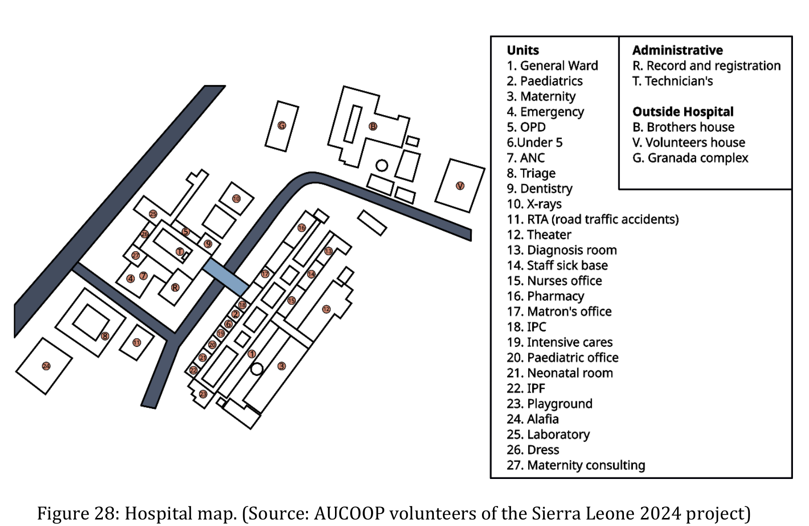

# St. John of God Hospital, Lunsar, Sierra Leone

**2018–2026 · KoboToolbox, then Bahmni (GNU Health as model) · Current state: configured; running on
paper as of July 2026**

## Context

A Catholic mission hospital at Mabesseneh, on the edge of Lunsar (~36,000 people), Port Loko
District — a district of 615,000 people with two government hospitals and this one. Around 100–150
outpatients a day, 20–25 inpatients; 6 doctors, 25 nurses, 3 lab technicians, 2 pharmacists, 2 clerks.

**Bed capacity is recorded three ways** — 25, 85 and 100 — across project documents. The hospital's
own Ministry and church-association returns say 85; 20–25 is the daily census. The figure is left
unresolved here deliberately: it is the best illustration in the archive of why
[D-1](../4-Instruments/D1-Data-Capture.md) exists.

Reporting obligations: monthly statutory returns to the Ministry of Health and Sanitation
(morbidity, IPD morbidity, bed state, mortality, surgical, X-ray, immunisation, safe motherhood,
ANC, emergency, theatre, laboratory, dressing) and quarterly to CHASL. All handwritten as of July
2026.

## The trajectory

| Year | What | What it left |
|---|---|---|
| 2018 | Requirements elicited from the administrator: stock control, retrievable clinical history, compatibility with Quickbooks Enterprise 2016. Platform shortlist Odoo / GNU Health / OpenMRS. An academic management system for the nursing school. | A report. Whether the academic system was ever used is disputed in the archive. |
| 2019 | Continuation. | Plans the 2024 team could not find. |
| 2022–23 | KoboToolbox on two tablets for ward data collection; computers tried and abandoned because staff had not used them. | Forms; a review in Jan 2024 found 2 of 11 with data. |
| 2023–24 | Five more tablets; a Linux server; the "SJOG Data Analysis" web app; maintenance training, certified by a partner institution. | The training certificate. No handover pack. |
| 2024 | Remote design of a 22-AP cabled network with point-to-point radios and solar (Rodríguez Trabal). Never deployed as designed. **The 2024 cohort wrote the only handover index in ten years.** | The campus map above; the lightning/fibre analysis; the handover README. |
| 2025 | A ~28-node OpenWrt 802.11s mesh, Starlink uplink, fibre road crossing for lightning isolation. Emergency's cable: groundings in, cable unverified. | The AP maps; the network survey. |
| 2026 | 19 Feb–7 Mar: Bahmni deployed — Phase 1 registration and EMR, Phase 2 lab and pharmacy mostly. GNU Health configured off-site to the same profile. | Two repositories; a Help Center; and, four months later, fourteen handwritten returns. |

## Infrastructure as built (2025–26)

Satellite uplink (~50 Mb/s). Around 28 inexpensive routers on OpenWrt meshing over 802.11s. Fibre
between AP21 and AP4 across the road, chosen because glass cannot carry a lightning strike between
buildings. Mesh latency measured above 1 s at the far end — against KoboCollect, never against Bahmni.
Grid voltage 170–260 V; a UPS on the server. Carrier-grade NAT; WireGuard hub-and-spoke through a
VPS. Proxmox host.

## What happened after

In February 2026 a remote check found the server inactive; one line, no follow-up. In July 2026 the
fourteen statutory returns were photographed — all handwritten. The Safe Motherhood sheet is a
photocopy of a February 2021 form with "July 2026" written over the printed month.

## What we would do differently

By this handbook's own [level decision](../4-Instruments/B2-Level-Decision.md), the hospital
qualified for level 1 or 2: no paid full-time IT post, no funded owner, no support contract. A level-4
system was deployed. The engineering was careful; there was no instrument at the time that made the
mismatch visible before the decision. That is why the [stop rule](../2-Story/2.03-Should-We-Deploy.md)
is the first thing in this handbook.

Three other things: verify the Emergency link physically before scoping a phase there; measure mesh
latency with the real application; and leave a handover pack — the 2024 cohort showed it works.

## Current state

Configured, not adopted. The February 2026 outage is unexplained. Whether any unit has retired a paper
register is unknown. The six- and twelve-month checks this handbook now requires were not scheduled.

*Sources: companion thesis Ch. 3; Rodríguez Trabal (2024); the project archive 2018–2026.*
